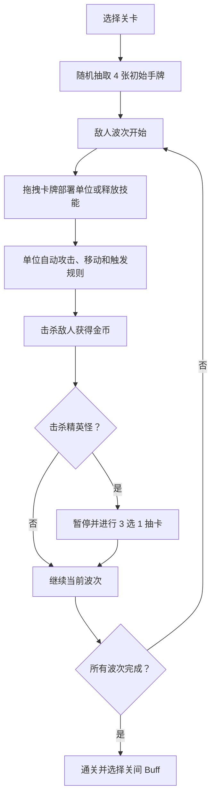
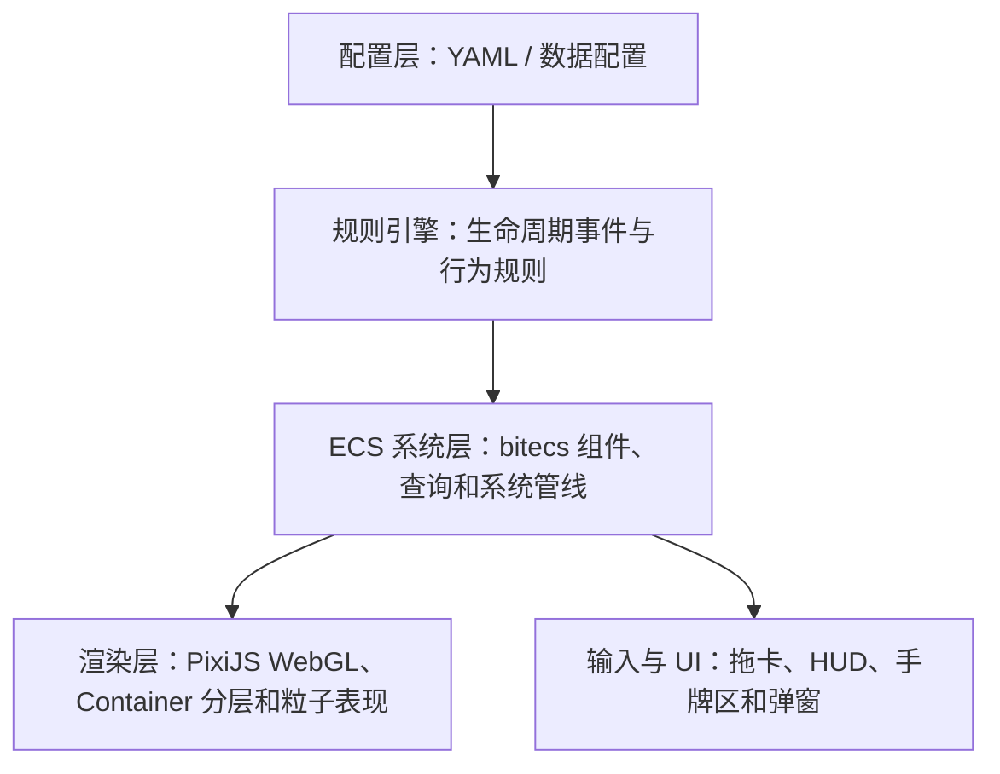

# Tower Defender

**Tower Defender** 是一款卡牌驱动的关卡制塔防游戏，在传统塔防的布阵、防守和波次压力之上，加入手牌选择、精英掉落和轻 Roguelike 成长。玩家通过拖拽卡牌部署塔、士兵、机关，守住地图左侧的水晶，并在 5 个主题关卡中逐步解锁新的卡牌和强化组合。

设计文档入口见 [design/README.md](./design/README.md)，技术架构权威说明见 [design/06-technical.md](./design/06-technical.md)。

## 游戏玩法

游戏的核心目标是防守水晶。敌人会从出生点沿固定路径推进，抵达水晶后持续造成伤害；玩家需要在路径周围的空地上布置防线，击杀敌人并撑过最后的 BOSS 波。

### 单关循环



### 核心规则

- **卡牌部署** ：手牌上限固定为 4 张，单位卡拖到可部署格后生成实体，技能卡拖到目标区域后立即释放。
- **策略布阵** ：地图为 21×9 网格，单位只能部署在路径相邻的空地上，不同逻辑层可以叠放不同类型单位。
- **经济成长** ：金币来自击杀和波次奖励，主要用于升级塔；金币只在当前关卡内生效。
- **精英抽卡** ：每波包含 1 个精英怪，击杀后触发 3 选 1 抽卡；手牌已满时需要替换现有手牌。
- **关间强化** ：通关后从 2 个随机 Buff 中选择 1 个带入后续关卡，失败后本次 Run 的 Buff 清空。
- **永久解锁** ：首次通关关卡会解锁新的主题卡牌，加入后续关卡的永久卡池。

### 内容结构

| 类型 | 内容 |
| --- | --- |
| 关卡 | 5 个主题关卡，顺序解锁，每关有独立地图、敌人、天气和 BOSS |
| 卡牌 | 单位卡、技能卡、奥术卡 |
| 单位 | 塔、士兵、机关、敌人和 BOSS 共享统一单位模型 |
| 阵营 | 正义、邪恶、混乱、中立 |
| 天气 | 晴、雨、雪、雾、夜，主要服务视觉氛围，不改变战斗数值 |

## 技术架构

项目使用 **Vite + TypeScript** 构建，核心运行时由 **bitecs ECS** 、规则引擎和 **PixiJS WebGL** 渲染层组成。整体目标是让玩法内容尽量配置化，让系统代码负责通用规则和运行效率。



### 配置驱动

单位、卡牌、关卡、技能和 Buff 以配置为主要事实来源。新增塔、敌人、机关或关卡时，优先改配置而不是改系统代码；系统通过统一字段和规则处理器解释配置。

### ECS 系统

实体使用 `bitecs` 表示，组件是纯数据，系统通过 `defineQuery` 获取匹配实体并在固定管线中更新。管线按数据依赖拆成管理、视觉计时、状态修改、核心玩法、生命周期、创建、AI、渲染等阶段，保证战斗结算和表现同步有稳定顺序。

### 规则引擎

规则引擎负责把配置中的声明式行为转成运行时效果。系统检测到 `onCreate`、`onDeath`、`onHit`、`onAttack`、`onKill` 等事件后，交由 `RuleEngine` 分发到对应 `RuleHandler`，实现爆炸、连锁攻击、召唤、Buff、击退等效果。

### 渲染与输入

PixiJS 负责 WebGL 渲染，场景以多层 `Container` 组织：背景、棋盘、阴影、实体、特效、天气、屏幕特效和 UI 分离。输入事件先进入 `InputManager` 队列，再在帧更新中统一派发，避免浏览器事件回调直接修改 ECS 世界。

## 美术特点

游戏采用程序化几何美术风格：所有单位、地块、特效和 UI 元素主要由 PixiJS `Graphics`、文本和粒子组合生成，而不是依赖大量外部贴图。这样可以让视觉表现和配置数据保持一致，也方便快速扩展不同主题。

### 视觉风格

- **几何化单位** ：塔、士兵、敌人和机关由圆形、矩形、三角形、菱形等基础图形组合，强调清晰识别。
- **主题化关卡** ：绿野、沙漠、古堡、废土、深渊等关卡使用不同地块配色、障碍物和环境装饰。
- **分层场景** ：地格层、地面层、低空层、特效层和天气层分开渲染，既服务玩法判定，也保证遮挡关系清楚。
- **天气氛围** ：雨滴、雪花、雾团、夜晚暗角和微光点用于强化关卡气质，但不额外增加数值记忆负担。
- **核心目标突出** ：水晶使用红色菱形、浮动和呼吸辉光表现，低血量时闪烁强化危机感。

### UI 表现

界面围绕战斗决策组织：顶部 HUD 展示关卡、波次、金币和水晶 HP；底部手牌区固定展示 4 张卡牌；3 选 1 抽卡、关间 Buff、结算和暂停等面板通过覆盖层呈现，保证玩家在战斗中能快速判断当前状态。

## 快速运行

```bash
npm install
npm run dev
```

常用命令：

```bash
npm run typecheck
npm test
npm run build
```

开发服务器默认运行在 `localhost:3000`。
